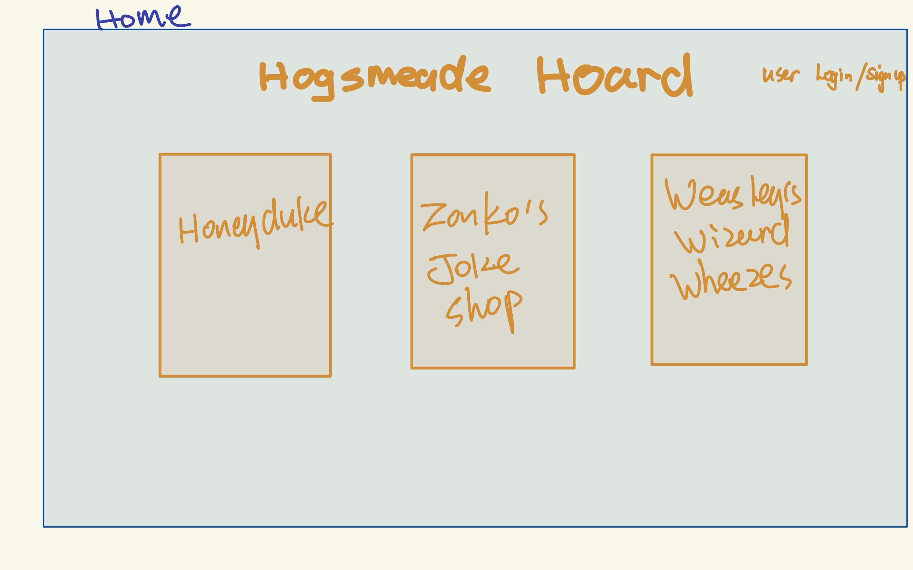
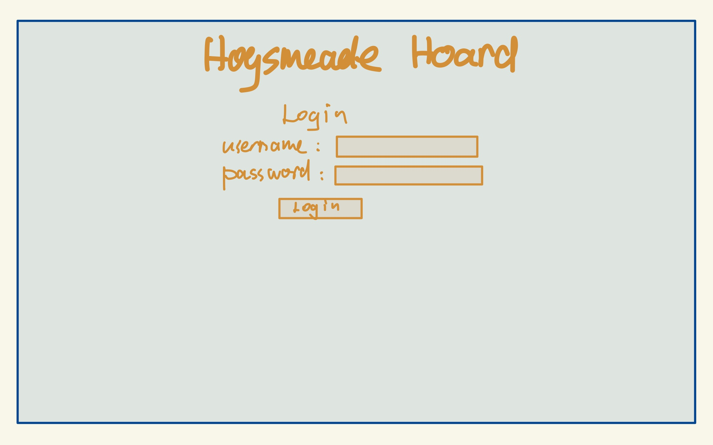
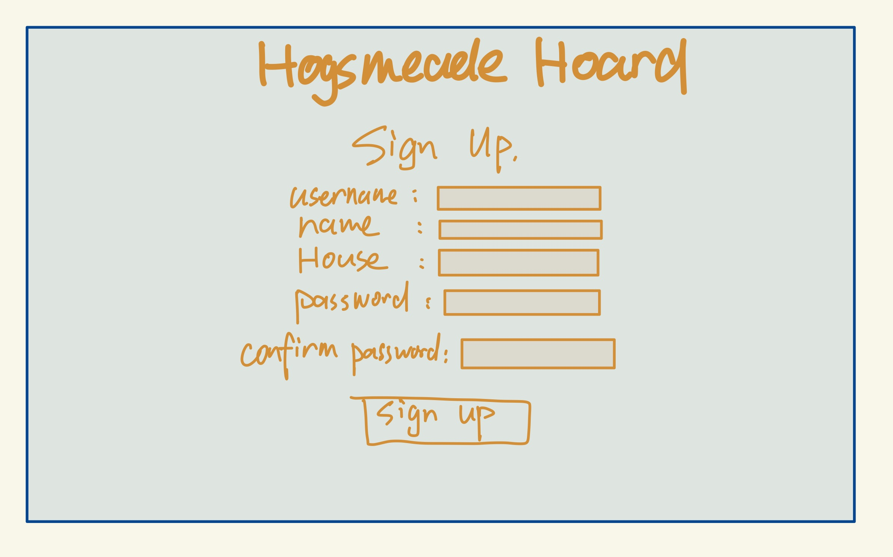
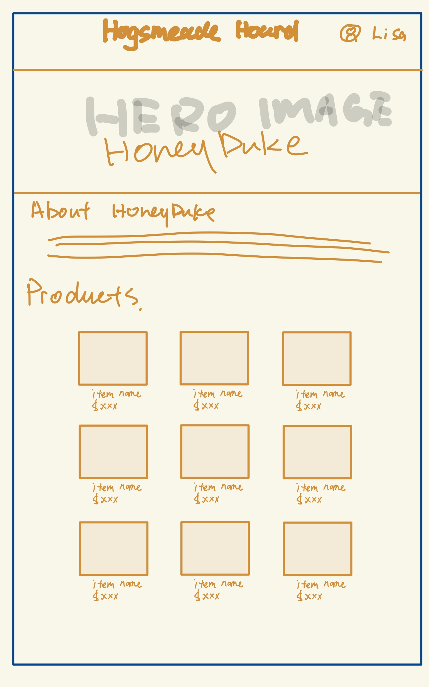
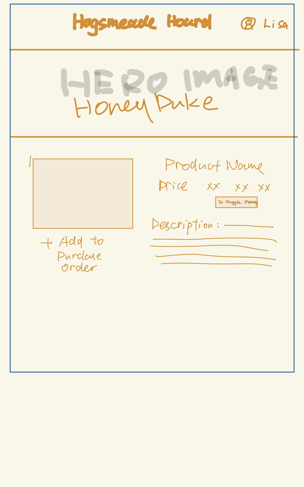
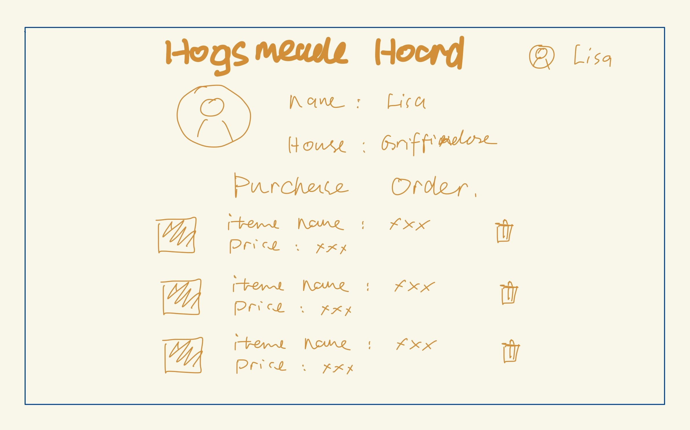

# Project Title

Hogsmeade Hoard: Wizarding Wares Online

## Overview

Welcome to "Hogsmeade Hoard: Wizarding Wares Online," the premier destination for fans of the magical world seeking to bring a piece of Hogsmeade into their own homes. Our online marketplace offers an unparalleled selection of enchanting merchandise, directly from the cobblestone streets of the most famous wizarding village in the world. Our user-friendly platform allows witches, wizards, and Muggles alike to explore the various shops of Hogsmeade from the comfort of their home.

### Problem

The Harry Potter series has offered fans an unparalleled avenue of escape, adventure, and belonging. The website aim to recreate the atmosphere of Hogsmeade by making its magical shops accessible to fans everywhere with detailed product descriptions and thematic storytelling. It is also a comminity and fandom website that provides information related to Hogsmeade shops and merchandise.

### User Profile

Who will use your app? How will they use it? Any special considerations that your app must take into account.
This app's target users are Harry Potter fans, ranging from young readers discovering the magic for the first time to adult enthusiasts who have grown up with the series. 

Users will engage with "Hogsmeade Hoard" as a portal to explore and purchase merchandise from the fictional village of Hogsmeade. They will browse through various shops, read about products, and select items based on their interests. Selected items will be added to a "Purchase Order", which act as a liked list for each user's profile. It creates a imaginative and playful experience for fans to engage with the maigc world. 

### Features

- User login and sign up
- Select shops: there will be a list of shops for the user to select to browes products offered by the shop. Shops and merchandise will be available for browsing wihtout loging in.
- View the details of a certain merchandise - Detail page will include the Image, Description and Price of the merchandise. Price will be in magical world currency and can be converted to muggle money. There will be an option for user to add the current item to their PO. If user is not logged in and trying to add item. The app will prompt user to login
- Viewing PO: A user will be able to view anything they added to their PO under their profile.

## Implementation

### Tech Stack
React 

Node

Express

Mysqls

JWT

### APIs

The project will not be using external source API. 

### Sitemap

**Home**: Home page lists all the shops available and there will be an option for user to signup or login. If user is logged in, it will show the user's avatar and profile.

**Login page**: For user to enter username and password to login.

**Signup page**: For user to enter information to signup.

**Shop pages**: A shop page include an introduction of the shop and a list of all merchandise available in that shop. Each merchaandise can be clicked to view details. 
- Shops includes Honeydukes, Weasleys' Wizard Wheezes, Zonko's Joke Shop, Scrivenshaft's Quill Shop

**Merchandise Details page**: This page includes the merchandise images, descriptions and price.

**User Profile page**: Include the user's information and their Purchase order.

### Mockups

### Data

Shops table: id(pk), description, image

Merchandise table: id(pk), shop_id(fk), description, price, image

User table: id(pk), name, password_hash, house

POItem table: id(pk), user_id(fk), product_id(fk)

### Endpoints

GET 
- api/shops - return all shops
- api/shops/:id - return a specific shop
- api/products - return a list of products
- api/products?shopId=SHOP_ID - return a list of products that belongs to a certain shop
- api/products/:id - returns a product with specified id.
- api/users/profile - get info for a specific user
- api/purchase-order - List all selected product for the currently authenticated user

POST
- api/login - user login
- api/singup - user signup
- api/logout - user logout
- api/purchase-order -  Create a new product for current user's purchase order.

PUT
- api/users/profile - Update the profile information of the currently authenticated user

### Auth

Yes. It will include authentication. I will use JWT to menage user session and to ensure users only get authorized information, and performing authorized operations.

## Roadmap

- Build database for shops and products. find images. complete text based info
- Gather assets: icons, hero images, etc.
- Setup Development Environment: Install Node.js, React, MySQL, and any other necessary development tools.
- Implement Authentication: Set up Passport.js for user authentication, including routes for login, signup, and logout.
- Develop Shop and Product APIs: Fully implement APIs for fetching shop lists, shop details, product lists, and product details.
- Setup Purchase Order Logic: Implement the backend logic for creating and viewing purchase orders.
- User Profile Management: Develop the API for managing user profiles and updating user information.
- Basic Frontend Setup: Initialize your React application and set up routing with React Router.
- Pages and Navigation: Implement the basic structure and navigation for your app, including the home page, shop pages, and user authentication pages.
- Integrate with Backend: Connect your frontend to the backend API, ensuring that data fetching for shops and products is working as expected.
- Authentication Flow: Implement the frontend logic for user signup, login, and session management.
- Purchase Order Functionality: Develop the frontend components for viewing and managing purchase orders.
- Merchandise Details Page: Implement the details page for merchandise, including image display, description, price, and the add-to-purchase-order feature.
- Currency Conversion: Integrate the magical world currency to muggle money conversion feature on the frontend.
- Testing and Bug fix

## Nice-to-haves

- Send the user's pruchase order to their email.
- Comments and reviews.
- User auth roles(admin and regular), to allow users to adding products and admin to approve.
